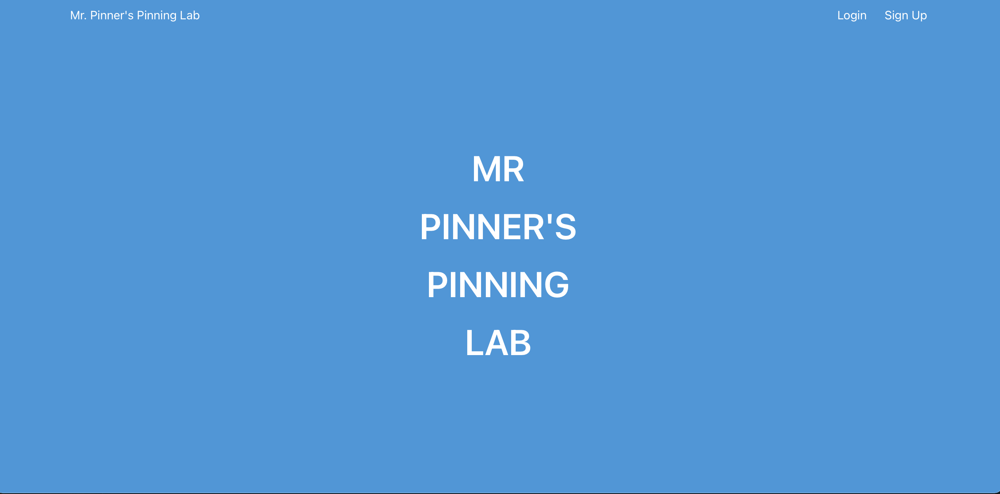

# Welcome to the Mr Pinner's Pinning Lab code base

This little web app is for uploading and pinning images in IPFS.
It uses [Blockfrost.io](https://blockfrost.io) in the backend for all IPFS operations.

# Features
	+ Flask app Setup for expansion
    + Default site pages controlled with Flask Blueprints [app/home folder etc]
    + Authentication built in with Flask-Login [app/auth folder]
    + IPFS Upload and Pinning [app/lab folder]
    + Database controlled by SQLAlchemy [SQLite by default]
    + Monitored with New Relic


### TODO 

 - Add code for MySQL type DBs
 - Add ADA payment code





## Pre-setup

Clone the repo

```bash
git clone https://gitlab.com/deafmice/mr_pinners_pinning_lab.git
```

Containers need a local `.env` file [see the example below]

```bash
source .env
```

Currently the DB needs to be initialized via the `manage.py` Python script in `app` directory.

Create a virtualenv, then source it, then pip install the requirements

```bash
cd app
virtualenv -p python3 venv
source venv/bin/activate
pip install -r requirements.txt
```

Then run the `manage.py` script to create the default tables

```bash
python manage.py --create_db
```

This will create `pinning_lab.db`

You are now ready to `cd ..` back to the main folder and run the `docker-compose` command


### Now Built with Docker!

Run Docker compose

```bash
docker-compose up --build -d
```

This will build four containers.  

```bash
docker ps
CONTAINER ID   IMAGE                              COMMAND                  CREATED          STATUS          PORTS                                                 NAMES
cdae3070465b   nginx:latest                       "/docker-entrypoint.…"   51 seconds ago   Up 50 seconds   0.0.0.0:80->80/tcp, :::80->80/tcp                     mr_pinners_pinning_lab_nginx_1
cdeab611cc87   mr_pinners_pinning_lab_flask_app   "gunicorn --bind 0.0…"   52 seconds ago   Up 51 seconds   5000/tcp, 0.0.0.0:5001->5001/tcp, :::5001->5001/tcp   flask_app
f06efa9ae015   redis:latest                       "docker-entrypoint.s…"   52 seconds ago   Up 51 seconds   6379/tcp                                              redis
```

Once built and running go to [http://localhost](http://localhost) to signup and login


### EXAMPLE local .env file

```bash
export DOCKER_BUILD_NUM='latest'
export FLASK_APP=app.py
export FLASK_DEBUG=1
export FLASK_ENV=development

# Misc ENV vars
export TOKEN_SALT='token'

# Blockfrost API
export BLOCKFROST_IPFS=YOUR_API_KEY

# New Relic
# Change out env based on environment
export NEW_RELIC_ENVIRONMENT='development'
export NEW_RELIC_LICENSE_KEY=YOUR_LICENSE_KEY
export NEW_RELIC_LABELS='Application:MrPinnersPinningLab;Geo:World;Team:DEAFMICE;Environment:development'
```

### Docker tear down and destroy

Stop the containers

```bash
docker container stop $(docker container list -q)
```

Prune the left over chaff

```bash
docker system prune -a -f
```


